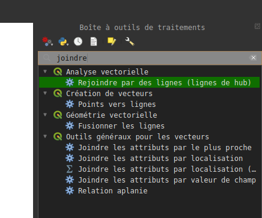
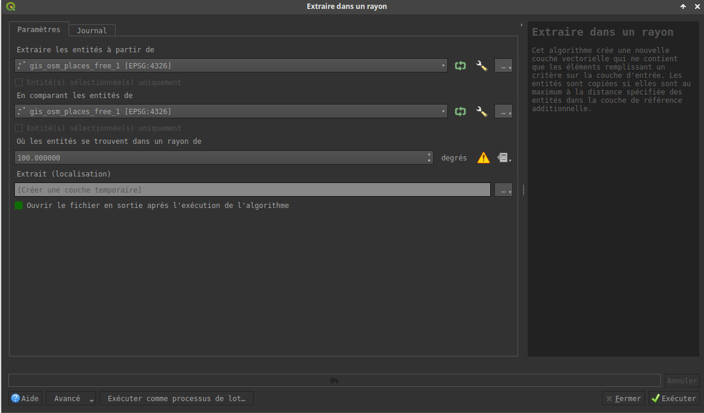
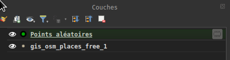
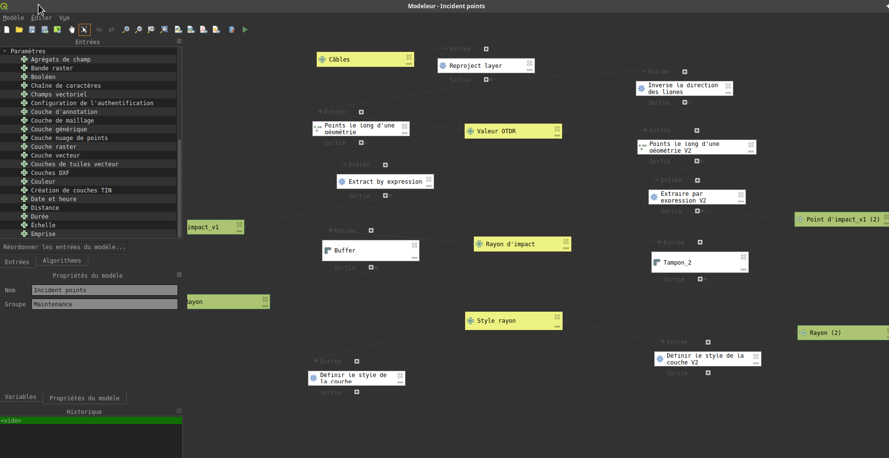
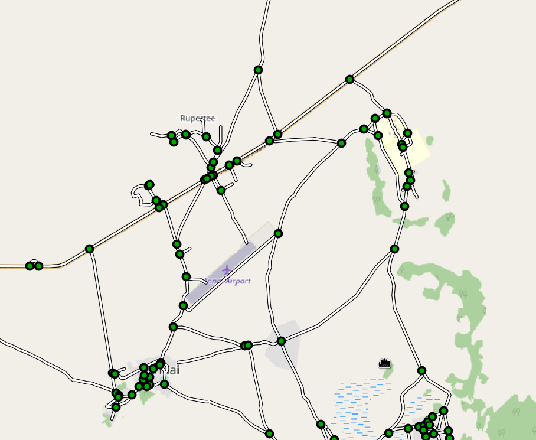
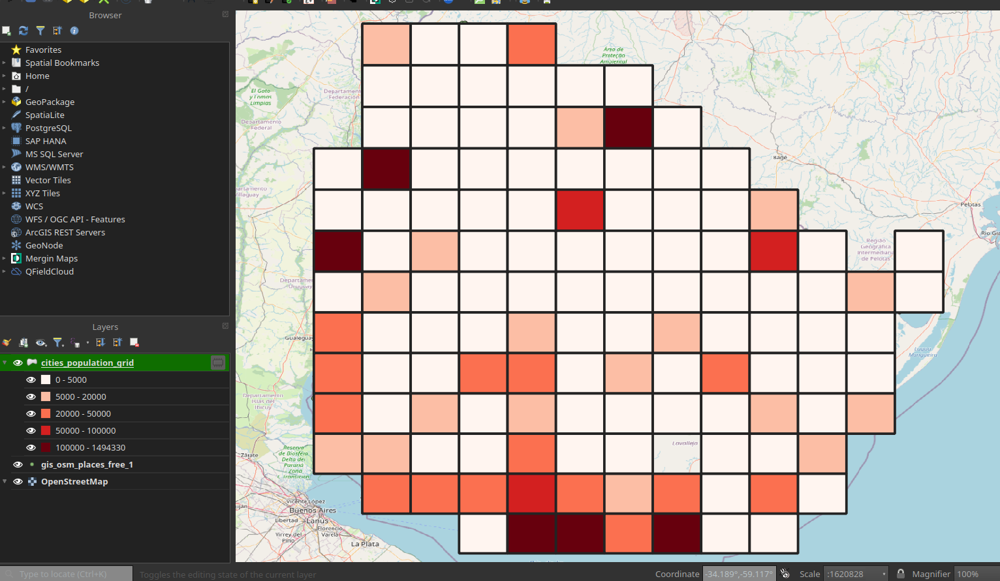

# Processings et algorithmes de géotraitement

QGIS propose ce qu'on appelle des "algorithmes de traitement", ou "processings". Il s'agit de scripts permettant de lancer des traitements et analyses divers et variés sur les données / couches ouvertes dans le logiciel.

Ces scripts sont disponibles dans la boîte à outils de traitement de QGIS (`Traitement` > `Boite à outils`), avec une barre de recherche pour s'y retrouver plus facilement :

En cliquant sur un script dans la liste, une fenêtre s'ouvre dans laquelle on peut voir :

- un texte sur la droite qui explique ce que fait le script
- les paramètres du script sur la gauche, à sélectionner pour lancer son traitement
- un bouton 'Aide' (très utile) qui ouvre un lien navigateur sur la doc technique de l'algo (quels paramètres utiliser, de quel type ...)
- d'autres trucs comme "Exécuter en processus de lot" qui permet de lancer plusieurs scripts en parallèle, ou d'autres actions pour copier les commandes python ou bash permettant de lancer les traitements

A noter que les couches générées par ces algorithmes de traitement sont généralement des **couches temporaires** (enfin sauf si on choisit de sauvegarder l'output vers un fichier), ce qui signifie qu'elles existent uniquement en mémoire vive de QGIS. Et donc en fermant QGIS ces couches seront perdues si elles n'ont pas été enregistrées.

Un symbole en forme de barrette de RAM (ou d'araignées) permet de distinguer ces couches temporaires. Il est d'ailleurs aussi possible d'en créer dans le menu "Couches".

### Exercice: lancer les algorithmes suivants et comprendre ce qu'ils font

Pour lancer les algorithmes il faut avoir des données dans QGIS, de plusieurs types si possible : des couches vecteurs points, lignes et polygones, et un raster par exemple le MNT SRTM qui couvre la Bretagne. Pour cela vous pouvez récupérer des données dans les zips du tuto CNRS, ou des jeux de données de votre choix sur [geo.data.gouv.fr](https://geo.data.gouv.fr/fr/), ou télécharger les données OSM pour un pays au choix sur la page suivante: http://download.geofabrik.de/ (les archives `.shp.zip`). Privilégier de préférence un pays pas trop trop grand ou avec des données pas trop volumineuses (pour éviter que certains algos prennent trop de temps).

*PS: il s'agit des données du projet OpenStreetMap, la base de données geographique libre et collaborative qui recense beaucoup de choses: bâtiments, routes, magasins, transports, eau, infrastructures éléctriques, points d'interêt divers et variés, et [pas mal d'autres choses](https://wiki.openstreetmap.org/wiki/Map_features). Ce sont les contributeurs qui référencent et construisent les données, disponibles gratuitement sous licence OpenSource, via des appli mobiles par exemple, dont [StreetComplete](https://f-droid.org/en/packages/de.westnordost.streetcomplete/) (lien qui pointe vers fdroid, un store Android d'applications opensource similaire au Play Store. L'appli est aussi sur le Play Store mais sans toutes les fonctionnalités)*

Que font les algos suivants ?

- Calculatrice de champ (en relation avec https://tutoqgis.cnrs.fr/07_02_calculer.php)
- Reprojeter une couche
- Joindre les attributs par localisation
- Extraire les sommets (à tester sur une couche de lignes/polygones)
- Centroïdes (à tester sur couche de polygones)
- Tampon
- Translater
- Prélèvement des valeurs rasters vers ponctuels

## Modeleur graphique

Il est possible de créer ses propres algorithmes grâce au *modeleur graphique*, un outil de QGIS qui permet de dérouler sa logique de traitement à appliquer et chainer ces différents algos à la suite les uns des autres. L'idée étant d'automatiser l'enchaînement d'algos lancés à la suite les uns des autres.

Dans la boite à outils de traitement, le premier bouton rouge en-haut permet de créer des modèles ou d'en importer (ou alors Traitement > Modeleur Graphique)

Dans la fenêtre du modeleur graphique, on voit sur la gauche 2 onglets :

- Entrées: il s'agit là des paramètres de traitement disponible et qu'on peut utiliser pour notre nouvel algo
- Algorithmes: il s'agit là de tous les algos présents dans la boite à outils de traitement et qu'il est possible d'utiliser pour dérouler notre logique

Dans notre chaîne de traitement, lorsqu'on configure un algorithme et ses paramètres notamment, il est possible de choisir les entrées/paramètres qu'on a nous-même déclarés, ou alors de prendre la sortie d'un autre algorithme, ce qui permet de chainer les étapes de traitement les unes entre les autres.

Afin de sortir des outputs du modèle, il faut rentrer un texte dans le paramètre qui indique la sortie d'un algo utilisé dans le chaîne: ce sera le nom de la couche temporaire qui sortira du modèle. 

### Exercice: créer un nouvel algorithme de traitement avec le modeleur graphique

- Télécharger les données OSM pour une pays au choix sur la page suivante: http://download.geofabrik.de/ (les archives `.shp.zip`). Privilégier de préférence un pays pas trop trop grand ou avec des données pas trop volumineuses (pour éviter que certains algos prennent trop de temps).

- Récupérer le fichier SHP des routes et l'ajouter à QGIS (`gis_osm_roads_free_1.shp`): on voit maintenant toutes les routes du pays dans la carte

- Créer un modèle qui permet d'extraire les intersections/carrefours de ces routes

Quelques trucs utiles :

- commencer par mettre un nom et un groupe sur la gauche du modeleur, afin de pouvoir le retrouver plus facilement par la suite

- enregistrer son modèle dans un dossier spécifique, puis ajouter ce dossier dans les paramètres de QGIS (Préférences > Options > Traitement > Modèles > Répertoire des modèles), ce qui permettra de charger ce modèle lors du lancement de QGIS

- en paramètres du modèle, il nous faudra déclarer une couche vecteur (ou encore mieux, une entrée de type "Entités vectorielles", ce qui permet éventuellement de restreindre le traitement aux entités sélectionnées uniquement)

- en sortie on veut une couche de point qui caractérise les intersections des routes

- un [thread sur gis.stackexchange.com](https://gis.stackexchange.com/a/370697) explique très gentillement la chaîne de traitement à monter:
    - Dissolve ("Regrouper" en français)
    - Multiparts to Singleparts ("De morceaux multiples à morceaux uniques" en français)
    - Line Intersections
    - Delete duplicate geometries

### Exercice: créer un nouvel algorithme de traitement avec le modeleur graphique

Toujours en se basant sur les données OpenStreetMap téléchargées plus tôt, ouvrir cette fois-ci dans QGIS la couche `gis_osm_places_free_1`. Il s'agit des localités, avec un champ qui indique la population notamment (la complétude peut dépendre du pays choisi).

Créer un modèle qui va générer une grille composée de carrés, et qui calcule pour chaque carré la somme de la population à l'intérieur, en se basant sur la couche OpenStreetMap. La longueur des côtés des carrés de la grille doit être dynamique, c'est-à-dire à choisir dans les paramètres. 

Quelques trucs utiles :

- Il existe un algo qui s'appelle "Créer une grille", en revanche attention à l'unité de mesure dans laquelle exprimer la longueur des côtés (mètres ? degrés ?). Mieux vaut utiliser ou donner l'emprise d'une couche ayant une projection métrique (par exemple Lambert 93/EPSG:2154 dans le cas de la France, ou Pseudo-Mercator/EPSG:3857 autour de l'équateur)

- Il faudra à un moment ou l'autre *joindre* la couche OSM à la grille pour récupérer / aggréger les infos dans les attributs de la grille

- En sortie du modèle, on peut appliquer une symbologie graduée à la couche générée, de sorte à pouvoir distinguer au travers de couleurs la population dans les carrés de la grille (ça s'appelle une analyse thématique):
