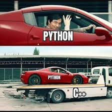

# Développement Python

QGIS est un logiciel écrit en ... C++ ! Ainsi, c'est en C++ que ce qu'on appelle le "coeur" du logiciel est développé : l'interface graphique, les actions principales, les algorithmes de traitement natifs ... bref QGIS tel qu'il est juste après une installation classique ([dépôt github](https://github.com/qgis/QGIS)).

La philosophie open source de QGIS est d'être construit et de regrouper plusieurs modules et librairies différentes: GDAL/OGR, GRASS, SAGA ...

Fort heureusement, il est possible de développer des outils custom interagissant avec les fonctions de QGIS et les données qui y sont présentes en utilisant python. 

Le nom de la librairie est **pyqgis**, [la documentation se trouve ici](https://qgis.org/pyqgis/3.28/) et avec cette lib il est possible d'interagir avec à peu près tout ce que propose QGIS, c'est un peu la philosophie du logiciel. Attention à bien lire la doc de la version de QGIS installée, la version *Long Term Release* actuelle étant la [3.28](https://www.qgis.org/en/site/getinvolved/development/roadmap.html).

Généralement les classes de l'API pyqgis commencent par `Qgs`: entités -> `QgsFeature`, géométrie -> `QgsGeometry`, couche de type vector -> `QgsVectorLayer`...

La librairie d'interface graphique avec laquelle QGIS est construit est Qt (prononcer "cute" ... vraiment ??). Qt (version 5 actuellement pour QGIS) est là aussi développée en C++ et adaptée/disponible en python grâce à des wrappers. Une image peut parfois en dire plus que des mots ...



La [documentation officielle propose aussi un tuto très complet](https://docs.qgis.org/3.28/en/docs/pyqgis_developer_cookbook/index.html) sur ce qu'il est possible de faire avec. Les [traductions](https://explore.transifex.com/qgis/) en français ne sont pas toutes complètes, même si c'est quand même autour des 90%.

## Quelques particularités de python

- Comme tous les langages, il y a des avantages et des inconvénients. C'est un langage qui est souvent considéré comme polyvalent et couteau suisse, dans le sens où l'étendue de ce qu'on peut faire avec est assez large: du petit script de 10 lignes lancé en CLI à des applications web complètes (avec Django ou Flask par exemple), en passant par des datasciences / big data / ML, ou des applications scientifiques poussées qui tirent parti des nombreuses libs optimisées et performantes pour le calcul numérique

- On peut faire de l'objet comme du fonctionnel (le `this` de Java est `self`, qu'il est nécessaire de mettre en premier paramètre des méthodes d'une classe)

- Pas de public/private/protected ... tous les attributs sont publics, il y a cependant une convention pour dire qu'un attribut ne devrait pas être utilisé en-dehors de la classe: mettre un underscore devant (ça marche sur la confiance hein)

- La version actuelle est la 3.11 (release en octobre 2022)

- L'indentation, c'est important. Nécessaire même ! Si le code n'est pas indenté, ça marche pa ! Mais généralement les IDE gèrent ça bien et c'est pas trop un problème (enfin les IDE du XXIe siècle du moins)

- Il s'agit d'un langage interprété et **le typage est dynamique !** A la manière du JavaScript, on n'est pas obligé de typer les variables et prototypes de fonctions au moment où on les développe. En python le typage relève de ce qu'on appelle les *best practices*, et c'est conseillé de typer son code pour faciliter la lecture et la compréhension. Il n'y a pas de gentil compilateur qui va venir te dire "eh salut t'es en train d'envoyer une string à une fonction qui attend une liste en paramètre". Bon il y a quand même des outils qui permettent de vérifier quelques trucs au niveau du code, des linters et autres, et les IDE permettent de voir passer pas mal de choses

- La gestion de la mémoire se fait via [comptage de référénce)(https://stacklima.com/gestion-de-la-memoire-en-python/).

- Le gestionnaire de paquets pour installer des librairies / dépendances est `pip`, qu'on peut utiliser de la manière suivante: `pip install ma_super_lib`. Le volume de librairies utilisables est assez important

- Un concept important de python est ce qu'on appelle les *environnements virtuels*, virtual environments ou venv: il s'agit d'un environnement dans lequel on exécute un programme développé en python, et c'est dans cet environnement que sont gérées les dépéndances installées ainsi que les versions (ça peut donner quelques maux de tête parfois). Pas de jar ou de compilation comme en Java, ce sont les sources qui sont lancées direct, et ce depuis un environnement virtuel dans lequel les dépendances doivent être installées. Sur QGIS pas besoin de se soucier de ça

- Le changement de version majeur entre python 2 et python 3 (release en 2008) a été plutôt brutal, des gros changements dans l'API ont été faits qui ont cassé beaucoup de softwares existants. Au moins ça permet de ne pas traîner trop de legacy.

- En python on utilise le snake case pour nommer les variables, les fonctions (déclarées via `def` et les fichiers): "J'aime le fromage" -> `j_aime_le_fromage` (vs `jAimeLeFromage` en Java et son camel case). Les noms de classe utilisent le Pascal case comme en Java: `MaSuperClass`. L'API python de QGIS ne respecte malheureusement pas celà :D et utilise souvent du camel case

- Les listes se déclarent de la manière suivante:

```python
from typing import Any, List

# déclaration
my_list: List[Any] = ["a", "b"]

# boucle
for element in my_list:
    print(element)
```

- Les dictionnaires (équivalent des maps Java) se déclarent de la manière suivante:

```python
from typing import Any, Dict

# déclaration
my_dict: Dict[str, Any] = {"a": 12, "b": True}

# boucle
for key, value in my_dict:
    print(key)
    print(value)
```

## Console Python de QGIS

Une première manière d'interagir avec QGIS est avec la console Python (`Extensions` > `Console Python`). Il s'agit d'un prompt python classique (comme dans un terminal après avoir tappé `python3`), mais enrichi avec les objets de l'API QGIS.

Quelques objets/classes utiles:

- `iface` (type [QgisInterface](https://qgis.org/pyqgis/3.28/gui/QgisInterface.html#module-QgisInterface)): il s'agit d'une abstraction de l'interface QGIS

- `iface.activeLayer()` -> renvoit la couche courante du projet QGIS, soit celle en surbrillance. Les couches (layer en anglais) présentes dans QGIS héritent toutes du type (abstrait) [QgsMapLayer](https://qgis.org/pyqgis/3.28/core/QgsMapLayer.html#module-QgsMapLayer). Les couches vecteurs sont du type [QgsVectorLayer](https://qgis.org/pyqgis/3.28/core/QgsVectorLayer.html#module-QgsVectorLayer), les couches raster du type `QgsRasterLayer`

- les entités vecteurs d'une couche ont le type [QgsFeature](https://qgis.org/pyqgis/3.28/core/QgsFeature.html#module-QgsFeature). On peut accéder à leur géométrie via la méthode `f.geometry()` et à leurs attributs avec une syntaxe crochet: `f["name"]` (get ou set, selon si le mode édition est activé ou non)

- pour récupérer les entités/features d'une couche/layer et boucler dessus:

```python
# récupérer la liste des layers qui s'appellent "abcd"
layers = QgsProject.instance().mapLayersByName("abcd")

# on vérifie s'il y a quelque chose dedans
if layers and len(layers) > 0:
    layer = layers[0]
    # boucler et afficher les entités dans la console
    for feature in layer.getFeatures():
        print(feature)
        print(feature.geometry())
        print(feature.attributes())
        print(feature.isValid())
        ...
```

### Exercice: ajouter quelques couches à QGIS en python

- ajouter dans la console python une couche shp à partir de son chemin

Indice: il faut créer un nouvel objet de type `QgsVectorLayer`

- boucler sur les entités d'une couche vecteur et afficher les géométries en format `geojson` (un autre format standard pour échanger des données SIG, qui est en réalité une structure bien définie de json. A noter qu'il s'agit également d'un format de fichier, qu'il est possible d'importer ou vers lequel exporter avec QGIS). Afficher également l'entité entière au format GeoJSON, pour celà il peut être utile d'utiliser un `QgsJsonExporter`

- ajouter dans la console python une couche au format WMS

WMS signifie *Web Map Service*, un protocole HTTP standardisé par l'OGC (l'Open Geospatial Consortium, soit l'organisation qui gère les normes et standards des données géo), qui permet de créer des couches **raster** depuis une source distante via un flux HTTP (il est également possible de lancer des requêtes).

On peut utiliser la source suivante: `https://geoservices.brgm.fr/geologie`, et d'abord créer une source de données [comme expliqué dans le tuto du CNRS](https://tutoqgis.cnrs.fr/03_02_donnees_flux.php#III22), afin de pouvoir ajouter la couche manuellement et visualiser la source.

- ajouter dans la console python une couche au format WFS

WFS signifie *Web Feature Service*, un protocole HTTP standardisé par l'OGC (l'Open Geospatial Consortium, soit l'organisation qui gère les normes et standards des données géo), qui fournit des données **vecteur** depuis une source distante via un flux HTTP.

On peut utiliser la source suivante: `https://services.sandre.eaufrance.fr/geo/sandre` (par exemple les stations hydro à la Réunion, soit la couche qui s'appelle `sa:StationHydro_REU`).
On peut d'abord créer une source de données [comme expliqué dans le tuto du CNRS](https://tutoqgis.cnrs.fr/03_02_donnees_flux.php#III23), afin de pouvoir ajouter la couche manuellement et visualiser la source.

### Exercice: geocoding

Le "*géocoding*" est une opération permettant de transformer une chaîne de caractère en coordonnées spatiales. C'est typiquement ce qui est réalisé dans une appli de navigation quand on tappe une adresse dans la barre de recherche. Un geocoding se fait généralement en lançant un appel à un webservice, qui contient derrière lui des bases de données et des algos permettant de calculer ça.

Il y a en réalité 2 types de géocoding:

- le *forward geocoding* (décrit dessus): transforme une String en coordonnées spatiales x/y
- le *reverse geocoding*: l'opération inverse, qui transforme des coordonnées spatiales x/y en chaîne de caractère ou autres données format texte (des adresses généralement)

Plusieurs API proposent des services de geocoding :

- L'[API géocodage](https://geoservices.ign.fr/documentation/services/api-et-services-ogc/geocodage-20/doc-technique-api-geocodage) de l'IGN, l'Institut national de l'information géographique et forestière qui produit et fourni beaucoup de données géo

- [MapBox](https://docs.mapbox.com/api/search/geocoding/), qui nécessite une clé et devient payante au bout d'un certain nombre de requêtes. D'ailleurs MapBox fournit également des services de données carto, des fonds de carte, mais aussi une librairie JavaScript et un SDK Android pour afficher et interagir avec des cartes dans une appli web ou Android. MapBox n'est pas opensource contrairement à d'autres librairies JavaScript comme [Leaflet](https://leafletjs.com/) ou [OpenLayers](https://openlayers.org/) (si ça vous intéresse, ça vaut le coup d'aller jeter un coup d'oeil aux tutos ou aux exemples qui sont bien faits)

- L'[API Nominatim](https://nominatim.org/release-docs/latest/api/Overview/) qui utilise les données OpenStreetMap pour proposer des services de geocoding. C'est celle-là qu'on va utiliser pour la suite.

Pour la suite, on aura besoin de télécharger le fichier geopackage `geocoding_nominatim.gpkg` et ajouter les deux couches que contiennent ce fichier dans QGIS.

- Geocoding: boucler sur les features de la couche `adresse`
    - récupérer la valeur du champ nommé `adresse`
    - envoyer une requête de geocoding à l'API Nominatim pour récupérer les coordonnées x/y puis les afficher

Pour lancer des requêtes HTTP en python, on peut utiliser la librairie `requests` comme ceci par exemple, pour récupérer des citations inspirantes grâce à l'[API quotable.io](https://github.com/lukePeavey/quotable):

```python
import requests

# récupérer une citation random
r = requests.get("https://api.quotable.io/random")

# récupérer une citation random avec une longeur de max 255 caractères (paramètre GET)
# -> va rajouter un paramètre GET en fin d'URL: https://api.quotable.io/random?maxLength=255
r = requests.get("https://api.quotable.io/random", params={"maxLength": 255})

# code de retour HTTP
print(r.status_code)

# données récupérées au format JSON, sous forme de dictionnaire ou de liste
data = r.json()
print(data)
```

-> Affichage des données récupérées:

```json
{
  "_id": "XrFIHIebkEW",
  "author": "The Buddha",
  "content": "As a water bead on a lotus leaf, as water on a red lily, does not adhere, so the sage does not adhere to the seen, the heard, or the sensed.",
  "tags": [
    "Wisdom",
    "Philosophy"
  ],
  "authorSlug": "the-buddha",
  "length": 140,
  "dateAdded": "2023-03-30",
  "dateModified": "2023-04-14"
}
```

-> récupérer le nom de l'auteur: `data["author"]`

Pour Nominatim, voici une commande CURL qui montre comment utiliser l'API:

```bash
curl "https://nominatim.openstreetmap.org/search?q=Paris&format=json" | json_pp
```

On remarque que l'API peut renvoyer plusieurs résultats, on peut utiliser le premier renvoyé.

- Faire la même chose avec Reverse Geocoding:
    - boucler sur les features de la couche `points`
    - récupérer les coordonnées x et y des géométries Point 

## Scripts de processing

Il est également possible de développer des algorithmes de traitement en python, qui permettent d'effectuer des traitements divers et variés sur les données géo présentes dans QGIS.

Il est possible de générer un script template, en-haut de la boite à outils de traitement, 2e bouton jaune (le symbole de Python) puis "Créer un nouveau script depuis un modèle". Là aussi, comme pour les modèles, il est conseillé de créer un nouveau dossier, y enregistrer ce fichier python et ajouter le dossier dans les paramètres de QGIS (Préférences > Options > Traitement > Scripts > Répertoire des scripts), ce qui permettra de charger les scripts présents dans ce dossier au démarrage de QGIS.

En lisant les commentaires du template de script python généré, on observe que :

- les algorithmes de traitement doivent hériter de la classe `QgsProcessingAlgorithm`

- il y a quelques méthodes à overrider pour que QGIS puisse faire tourner l'algo correctement:

    - `createInstance`, car c'est la mécanique de QGIS qui se charge de créer une nouvelle instance de ce script
    - `name`, `displayName`, `group`, `groupId`: les noms et identifiants qui permettent de retrouver le script dans la boîte à outils
    - `shortHelpString`: le texte de doc sur la droite de la fenêtre pour lancer le script
    - `initAlgorithm`: la méthode à l'intérieur de laquelle déclarer les paramètres dont a besoin le script. Ces paramètres héritent de la classe `QgsProcessingParameterDefinition`, ont un nom qui commence par `QgsProcessingParameter..` et seront choisi manuellement par l'utilisateur dans l'interface lorsque le script est lancé
    - `processAlgorithm`: la méthode à l'intérieur de laquelle le traitement est effectué. Généralement ça commence par récupérer les valeurs choisies dans les paramètres, puis les étapes et l'implémentation de la logique du traitement

### Exercice

Créer un script permettant de lancer une opération de geocoding sur toutes les entités d'une couche.

Pour celà, il y aura besoin de déclarer les paramètres suivants:

- une couche vectorielle de type Point (`QgsProcessingParameterVectorLayer`, récupérable via la méthode `self.parameterAsVectorLayer(...)`)
- le champ contenant les adresses à géocoder (`QgsProcessingParameterField`, récupérable via la méthode `self.parameterAsString(...)`)

Concernant l'output du script, on pourra déclarer un sink, comme dans l'exemple généré (`QgsProcessingParameterFeatureSink`), en lui donnant une géométrie de type Point et la projection WGS84 (code EPSG: 4326, soit celle dans laquelle les coordonnées renvoyées par l'API Nominatim sont exprimées), de la manière suivante:

```python
from qgis.core import QgsCoordinateReferenceSystem

# projection wgs84
crs_wgs84 = QgsCoordinateReferenceSystem(4326)

# déclaration du sink de sortie
(sink, dest_id) = self.parameterAsSink(
    parameters,
    CLE_DU_PARAMETRE_SINK,
    context,
    input_layer.fields(),
    QgsWkbTypes.Point,
    crs_wgs84,
)
```

## Développement de plugins

Afin de pouvoir partager et diffuser des outils customs à une échelle un peu plus carrée et industrielle, il est possible de développer des plugins/extensions.

Généralement, un plugin est fourni par un dépôt. Les plugins disponibles par défaut dans QGIS sont fournis par le dépôt officiel géré par l'OsGeo, il est tout-à-fait possible de [monter son propre dépôt](https://gis-ops.com/qgis-3-plugin-tutorial-set-up-a-plugin-repository-explained/?).

En développant un plugin, il va être possible de customiser pas mal de choses: ajouter des nouveaux types de sources de données, rajouter des boutons dans l'interface qui lancent des actions, ajouter des algorithmes de traitements, des panels, des widgets graphiques divers, des actions et types de vectorisation dans la 
carte ...

Le dossier contenant les sources du plugin doit se trouver dans le dossier d'installation QGIS (par défaut sur Linux c'est `~/.local/share/QGIS/QGIS3/profiles/default/python/plugins/`). Un plugin utile pendant le dev est `Plugin Reloader`, qui permet de recharger les modifs faites aux sources (c'est pas automatique malheureusement).

Il y a un plugin appelé `Plugin Builder 3` qui permet de générer un squelette de plugin QGIS en python, même si le squelette généré n'est pas super propre, contrairement au [projet `template-qgis-plugin`, avec un dépôt sur GitLab](https://gitlab.com/Oslandia/qgis/template-qgis-plugin), qui permet de générer un setup propre et un squelette de plugin QGIS bien fichu, avec des linters, des pre-commit hooks (des actions qui permettent de formatter ou vérifier le code commité), une doc déjà propre, des jobs de CICD paramétrés pour GitLabCI ou GitHub Actions, une config qui marche pour les tests unitaires ...

## Exercice

Installer les plugins `qgis2web` et `Qgis2threejs`, faire une carte avec quelques données dans QGIS puis générer une carte web 2d et 3d grâce à ces deux plugins (disponibles dans le menu Web en-haut).
